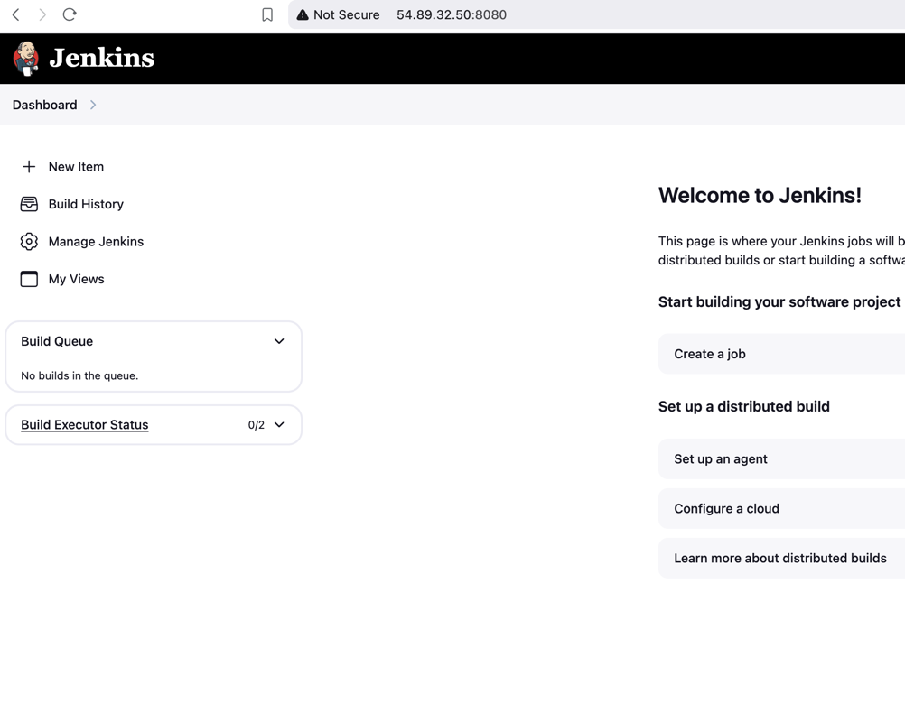

# Jenkins tutorials

## Free style projects:

### script for installation:

```commandline
#!/bin/bash
#this works only on amaszon-linux or redhat
sudo wget -O /etc/yum.repos.d/jenkins.repo \
    https://pkg.jenkins.io/redhat-stable/jenkins.repo
sudo rpm --import https://pkg.jenkins.io/redhat-stable/jenkins.io-2023.key
sudo yum upgrade
# Add required dependencies for the jenkins package
sudo yum install java-17 -y 
sudo yum install jenkins -y
sudo systemctl daemon-reload
sudo systemctl enable jenkins
sudo systemctl start jenkins
sudo systemctl status jenkins
```
Lunch a jenkins server
```commandline
<publicIp>:8080
```



```commandline
cat test.sh
```

```
#!/bin/bash
read -p "Enter you commit messages: " message

git add .
git commit -m "$message"
git push
```
